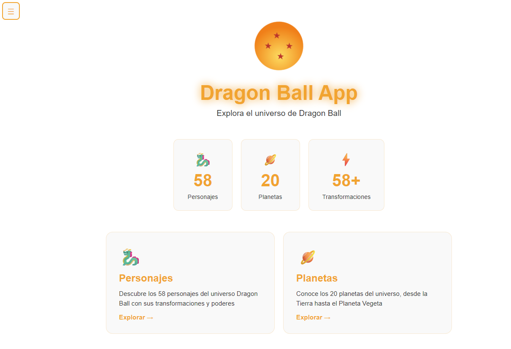
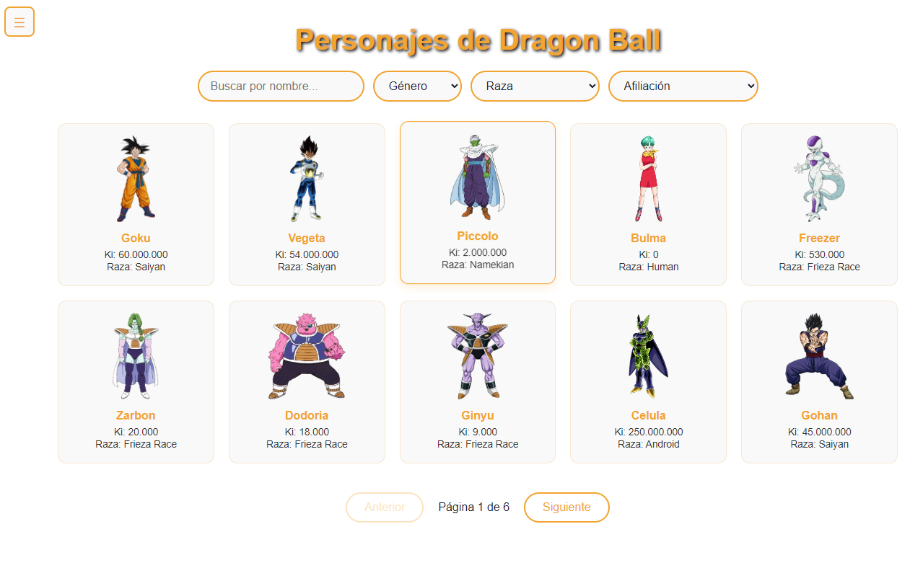
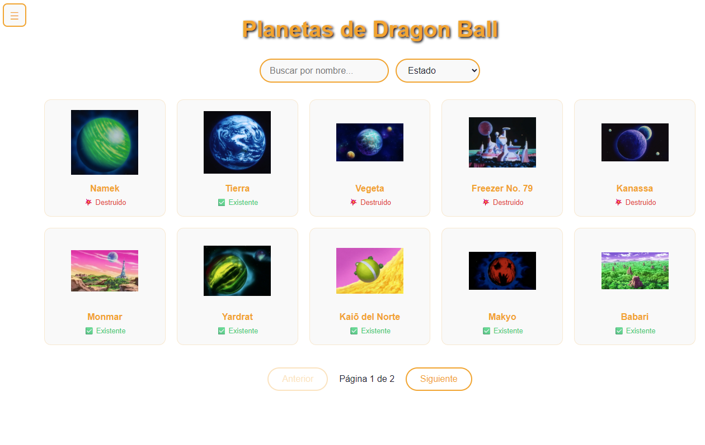

# 🐉 Dragon Ball App

Aplicación web desarrollada con **Angular 17+** que consume la [Dragon Ball API](https://dragonball-api.com) creada por [Antonio Álvarez](https://antonioalvarez.dev/).

---

## 📸 Características

- 🐉 **Personajes** — listado con filtros por nombre, género, raza y afiliación. Modal con transformaciones y planeta de origen.
- 🪐 **Planetas** — listado con filtros por nombre y estado. Modal con descripción.
- 🏠 **Página de inicio** — estadísticas del universo Dragon Ball.
- 🌙 **Modo oscuro/claro** — toggle con memoria entre sesiones.
- 💫 **Splash screen** — animación de las 7 bolas de dragón orbitando al arrancar.
- 📱 **Responsive** — adaptado para móvil y escritorio.
- ☰ **Sidebar hamburguesa** — navegación lateral con cierre automático.
- ❌ **Página 404** personalizada.

---

## 📸 Capturas

### 🏠 Inicio


### 🐉 Personajes


### 🪐 Planetas


---

## 🛠️ Tecnologías

- [Angular 17+](https://angular.dev/) — framework principal
- [TypeScript](https://www.typescriptlang.org/) — tipado estático
- [RxJS](https://rxjs.dev/) — manejo de observables y debounce
- [Dragon Ball API](https://dragonball-api.com) — fuente de datos

---

## 🚀 Instalación y uso

### Requisitos previos

- Node.js 18+
- Angular CLI 17+

### Pasos

```bash
# Clonar el repositorio
git clone https://github.com/JuanfraRB/dragon-ball-app.git

# Entrar al directorio
cd dragon-ball-app

# Instalar dependencias
npm install

# Arrancar en modo desarrollo
ng serve
```

Abre el navegador en `http://localhost:4200`

---

## 📁 Estructura del proyecto

```
src/
└── app/
    ├── pages/
    │   
    ├── models/
    │   └── character.model.ts # Interfaces: Character, Planet, Transformation, ApiResponse
    ├── pages/
    |   ├── sidebar/          # Menú lateral hamburguesa
    │   ├── home/             # Página de inicio con estadísticas
    │   ├── characters/       # Listado y filtros de personajes
    │   ├── planets/          # Listado y filtros de planetas
    │   ├── footer/           # Footer con créditos
    │   └── not-found/        # Página 404
    └── services/
        └── dragonball.ts     # Servicio HTTP con todos los endpoints
```

---

## 🔗 Endpoints utilizados

| Método | Endpoint | Descripción |
|--------|----------|-------------|
| GET | `/characters` | Listado paginado de personajes |
| GET | `/characters/:id` | Detalle de un personaje con transformaciones |
| GET | `/characters?name=&race=&gender=&affiliation=` | Filtros de personajes |
| GET | `/planets` | Listado paginado de planetas |
| GET | `/planets?name=&isDestroyed=` | Filtros de planetas |

---

## 🙏 Agradecimientos

Gracias a **[Antonio Álvarez](https://antonioalvarez.dev/)** por crear y mantener la Dragon Ball API de forma gratuita.

---

## 👨‍💻 Autor

**Juan Francisco Rodríguez Berenguel**  
Técnico Superior en DAM  
📍 Almería, España  
[](https://www.linkedin.com/in/juan-francisco-rodr%C3%ADguez-berenguel-356b931b1)
[](https://github.com/JuanfraRB)
